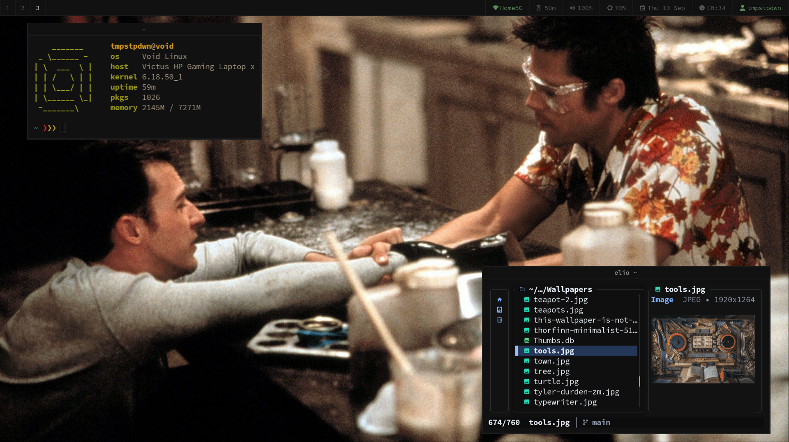

# Void Rice

My personal Void Linux rice.

## Screenshot

## Setup

- sway compositor and accompanying utilities like swaylock, swayidle, swaybg etc...
- waybar
- bemenu
- foot terminal
- fish shell
- elio terminal file manager
- mako notification daemon
- [wallpapers](https://github.com/tmpstpdwn/Wallpapers)
- SauceCodePro font

I have only listed those that are in the screenshot.
For an exhaustive list of all `void-xbps` packages i use, see [`~/.packages`](.packages).
